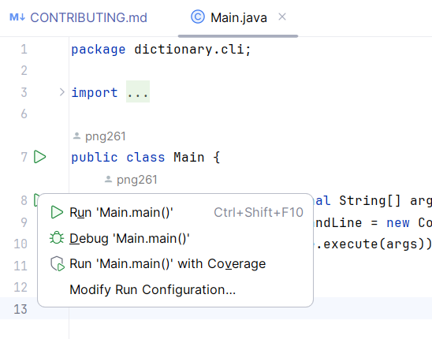

# How to Contribute

[Xem bản tiếng Việt/View Vietnamese version](CONTRIBUTING_vi_VN.md)

## Project Structure

This project is divided into 3 modules: `base`, `cli`
and `graphic`.

- The `cli` module compiles to the CLI's executable
  JAR file.
- The `graphic` module compiles to the GUI's executable
  JAR file.
- The `base` module comprises the core functionality
  that the two main modules share in common.

The filesystem structure of the project is as follows,
where `x` means a file named x, `[y]` denotes a
directory named y:

- `[base]`
    - `[src]`
        - `[main/java/dictionary/base]`
            - `...` (Entire source code of the **base** module)
    - `[target]`
        - `base-1.0.jar` (The compiled JAR file)
    - `pom.xml` (Information about the **base** module)

- `[cli]`
    - `[src]`
        - `[main/java/dictionary/cli]`
            - `...` (Entire source code of the **cli** module)
    - `[target]`
        - `cli-1.0.jar` (The compiled JAR file of the CLI)
    - `pom.xml` (Information about the **cli** module)

- `[graphic]`
    - `[src]`
        - `[main/java/dictionary/graphic]`
            - `...` (Entire source code of the **graphic** module)
    - `[target]`
        - `graphic-1.0.jar` (The compiled JAR file of the GUI)
    - `pom.xml` (Information about the **graphic** module)

## Git/GitHub Workflow

**You must not pull code from and push code to the main repo of
the project directly.**

In the main GitHub repo of the project, **click the Fork button
in the top right corner. A dialog appears, just click Create Fork**.

From then on, just **write your own code in the forked repo** (as
well as clone it, pull it, push it...), **not the original repo**.

Also, you must edit the files that you are assigned to work on only.
**Do NOT touch the files that are of someone else's responsibility**.

When your task is done, go to the forked repo on GitHub. There should
be two buttons below the green `Code` button: `Contribute` and `Sync Fork`.

Click the `Contribute` button, then click `Open Pull Request`. Name your
pull request properly, then click `Create Pull Request` at the bottom.
Your contributions will be merged to the original repo by the admin.
(Instead of directly pushing to the original repo, you have to fork it,
then create a pull request, and your pull request must be approved by
the admin so that your contributions are merged.)

If your task has not been done yet, but you want to get the latest code
in files written by other members, still follow the above procedure, but
click the `Sync Fork` button instead of `Contribute`. Then
[follows the steps in this link](https://docs.github.com/en/pull-requests/collaborating-with-pull-requests/working-with-forks/syncing-a-fork).

Last but not least, **your commit messages must comply with the rules of
[Conventional Commits](https://www.conventionalcommits.org/en/v1.0.0/)**.

## Setup

1. Clone the forked project to your local machine.
2. Make sure your machine has the following software
   installed:
    - JDK 20
    - IntelliJ IDEA
3. Open the project directory with IntelliJ IDEA.
4. In IntelliJ IDEA, press the `Ctrl` key twice, then
   type in: `mvn clean package install`.

## Development Process

**After finishing setup, you won't have to do the setup
process again.** Just write code in files that you are
assigned to write.

When you want to run:

1. Open the Main.java file of the CLI or the GUI module.
   There should be a **Run button** at the left of the
   line that the `Main` class or the `Main.main` function
   resides.

   

2. Click the **Run button**, then click `Run
   Main.main()` or `Debug Main.main()` to run
   the module directly.

3. If you want to test CLI with custom command line
   options, click the **Run button**, then click
   `Modify Run Configuration`. In the `Program arguments`
   text box, type in the command line arguments you
   want, then click Run.

   
