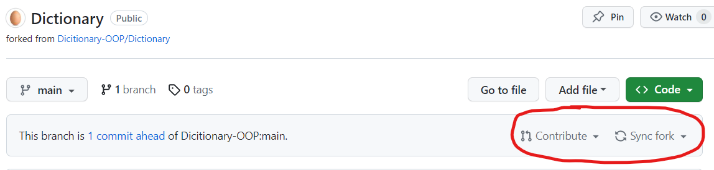
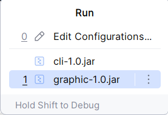
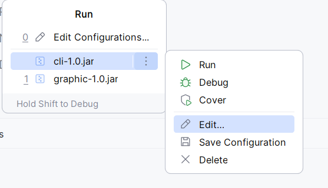
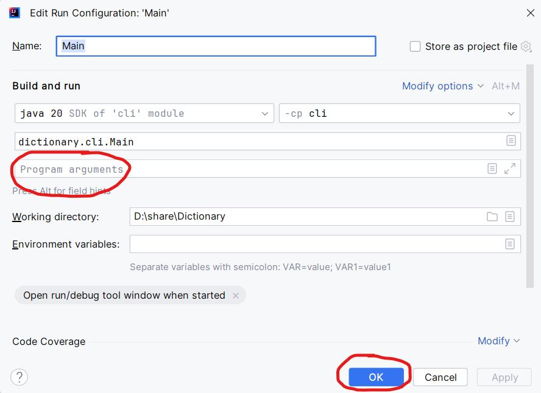

# Cách phát triển dự án

[View English version/Xem bản tiếng Anh](CONTRIBUTING.md)

## Cấu trúc dự án

Dự án được chia thành 3 modules: `base`, `cli` và
`graphic`.

- Module `cli` sẽ được biên dịch thành file JAR của
  phần giao diện CLI.
- Module `graphic` sẽ được biên dịch thành file JAR của
  phần giao diện GUI.
- Module `base` chứa các chức năng chung mà cả hai
  module trên đều cần dùng tới (các chức năng lõi của
  phần mềm).

Cấu trúc thư mục và file của dự án như sau, trong đó
`x` nghĩa là một file tên là x, còn `[y]` nghĩa là
một thư mục tên là y:

- `[base]`
    - `[src]`
        - `[main/java/dictionary/base]`
            - `...` (Toàn bộ code của module **base**)
    - `[target]`
        - `base-1.0.jar` (JAR file của module **base**)
    - `pom.xml` (Thông tin của module **base**)

- `[cli]`
    - `[src]`
        - `[main/java/dictionary/cli]`
            - `...` (Toàn bộ code của module **cli**)
    - `[target]`
        - `cli-1.0.jar` (JAR file của phần giao diện CLI)
    - `pom.xml` (Thông tin của module **cli**)

- `[graphic]`
    - `[src]`
        - `[main/java/dictionary/graphic]`
            - `...` (Toàn bộ code của module **graphic**)
    - `[target]`
        - `graphic-1.0.jar` (JAR file của phần giao diện GUI)
    - `pom.xml` (Thông tin của module **graphic**)

## Quy định về Git/GitHub

**Bạn không được phép pull và push trực tiếp lên repo chính của
dự án.**

Vào trang GitHub của repo chính, **click vào nút Fork ở góc trên
bên phải. Một hộp thoại xuất hiện, bạn chỉ việc click Create Fork**.

Từ đó về sau, **chỉ viết code ở trong repo mà bạn đã fork** (cũng
như clone, pull, push...), **chứ không phải ở repo chính**.

Ngoài ra, bạn chỉ được phép sửa các file mà bạn được giao việc.
**KHÔNG được chỉnh sửa các file không thuộc trách nhiệm của mình**.

Khi công việc của bạn hoàn thành, vào repo mà bạn đã fork trên GitHub.
Sẽ có hai nút bấm nằm dưới nút `Code` màu xanh, đó là `Contribute` và
`Sync Fork`.

Click nút `Contribute`, rồi click `Open Pull Request`. Đặt tên
hợp lý cho pull request của bạn, rồi click `Create Pull Request` ở
phía dưới cùng. Các đóng góp của bạn sẽ được người quản lý (admin) nhập
vào trong repo chính. (Thay vì push thẳng lên repo chính, bạn phải fork
nó, chỉnh sửa các phần thuộc trách nhiệm của bạn, rồi tạo pull request
trở lại repo chính. Và chỉ khi admin duyệt pull request của bạn, các
đóng góp của bạn mới được nhập vào trong repo chính).

Khi công việc của bạn chưa hoàn thành, nhưng bạn cần lấy code trong các
file của các thành viên khác về repo đã fork của mình (chẳng hạn: để chạy
thử), vẫn làm theo các bước như trên, nhưng click nút `Sync Fork` thay vì
`Contribute`. Sau đó [làm theo các bước trong link này](https://docs.github.com/en/pull-requests/collaborating-with-pull-requests/working-with-forks/syncing-a-fork).

Cuối cùng và cũng cực kỳ quan trọng, chú ý rằng **các commit messages của
bạn phải tuân thủ các quy tắc của [Conventional Commits](https://www.conventionalcommits.org/en/v1.0.0/).**

## Thiết lập dự án trước khi viết code

1. Clone repo về máy riêng (máy tính cá nhân) của bạn
   (local machine).
2. Đảm bảo local machine đã được cài đặt các phần mềm
   sau:
    - JDK 20
    - IntelliJ IDEA
3. Mở thư mục chứa repo bằng IntelliJ IDEA.
4. Trong IntelliJ IDEA, ấn phím `Ctrl` hai lần, gõ:
   `mvn clean package install` rồi bấm Enter.

## Quy trình Phát triển

**Sau khi thiết lập xong theo các bước như trên, bạn
không cần làm lại các bước đó nữa.** Chỉ cần viết code
trong các file mà bạn được phân công. Nếu muốn chạy thử:

1. Ấn tổ hợp `Alt-Shift-F10` ([thông tin thêm](https://stackoverflow.com/a/11159341/13680015))
   sau đó **đừng dùng chuột** ; dùng phím mũi tên
   Lên/Xuống trên bàn phím để chọn file JAR mình muốn
   chạy, sau đó bấm Enter.

   

2. Nếu bạn muốn test file jar CLI với các command line
   argument (đối số dòng lệnh), vẫn theo quy trình ở bước 1,
   vẫn dùng các phím mũi tên Lên/Xuống để chọn file jar CLI ;
   nhưng thay vì ấn Enter ngay, hãy **ấn phím mũi tên
   sang Phải, rồi ấn phím mũi tên Xuống để di chuyển tới
   nút Edit, và ấn Enter.**

   

   **Nhìn trong phần "Program
   Arguments", gõ vào đó các đối số dòng lệnh bạn muốn,
   rồi ấn nút Run ở dưới cùng để chạy.**

   

3. Chú ý về file `.idea/workspace.xml`: Bạn không được
phép commit file này. Hãy để file này nguyên vẹn, vì nó
chứa các run configurations để bạn có thể chạy các file
JAR mà tổ hợp phím `Alt-Shift-F10` mở ra.
